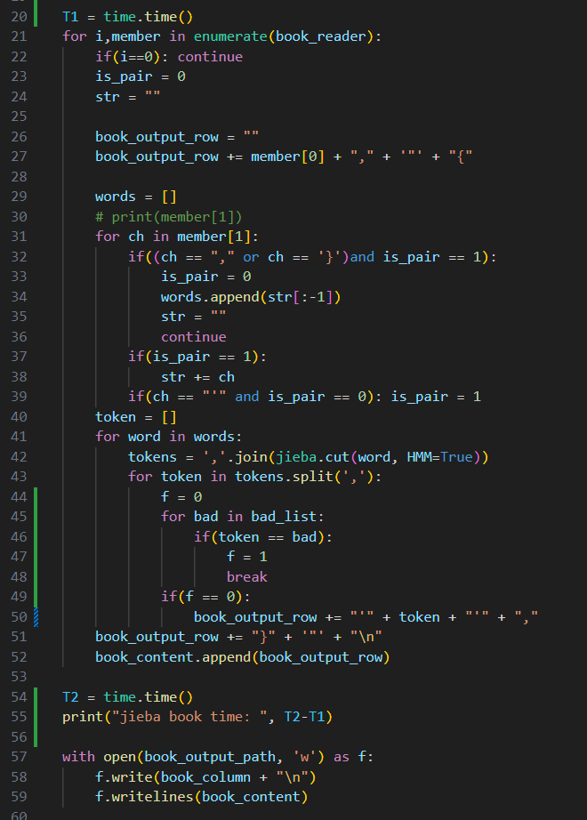
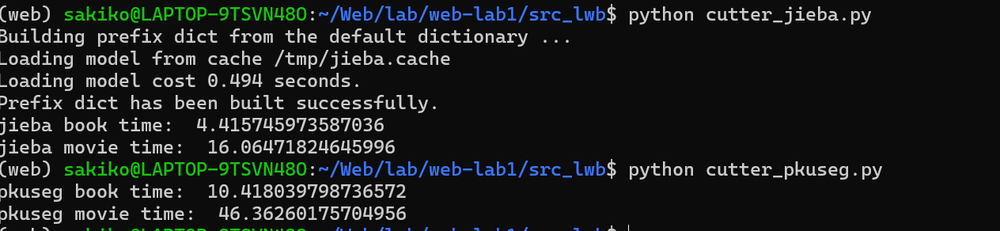

## Web LAb1

### Part 1
#### Section 1 分词
我是用了两种现成的分词工具，并自己加入了一些分词优化以使得分词的结果更符合后续实验要求。两种的现成的分词工具分别为jieba分词和pkuseg分词。完成代码时我并没有特别考虑到拓展性，所以我使用的时面向过程编程，分别对book和movie使用jieba分词和pkuseeg分词，这里我们使用jieba分词对book的tag的分词为例子。

具体的分词方式我们使用调包完成，代码的中间部分是对源csv文件的读取。原来的Tags使用的是一个由单引号、逗号、Tag等组成的字符串，这里把其中真正的Tag进行抽取并进行分词，最终以相同的格式重新储存到文件里面。其中值得一提的是，我们根据前期工作分词的结果，筛选出了我们不想要的一些代表不了信息的词汇汇总为bad_list，在提取时碰到这些词汇不会加入到分词表中。

接下来分析Jieba分词和PKUSeg分词
Jieba 分词基于 词典+HMM（隐马尔科夫模型） 的统计方法，使用双向最大匹配（Bi-MM）来匹配词典中的词语。HMM模型用于处理未登录词（未出现在词典中的词），通过字词的状态转移概率来预测分词边界。(本次实验中我们并未使用jieba分词的paddle模式，即使用paddle深度学习框架，我们也没能使用jieba分词的自定义字典)
PKUSeg 分词基于条件随机场（CRF）或深度学习模型的序列标注方法。使用大规模标注语料训练词边界的概率分布，通过全局最优来预测分词结果。

1. 性能对比
准确性: PKUSeg 在复杂场景和领域适配上表现优异，因为其模型能捕捉上下文和细粒度语义。
速度: Jieba 因为算法简单，分词速度更快，适合大规模实时处理任务。
未登录词处理: Jieba 依赖 HMM，可能效果有限；而 PKUSeg 的深度学习方法能够更好地识别新词。
2. 性能差异原因
算法复杂度: Jieba 是启发式规则与简单统计方法，性能上更轻量；PKUSeg 基于训练数据和深度学习模型，对算力要求更高。
数据依赖: PKUSeg 需要高质量标注数据进行训练，适应性强；而 Jieba 的性能主要受词典的质量限制。
上下文建模能力: PKUSeg 的深度学习模型能有效捕捉上下文关系；Jieba 的 HMM 模型对于长距离依赖能力较弱。

#### Section 2
#### Section 3 
### Part 2
#### Section 1 
#### Section 2
#### Section 3 协同过滤进阶
